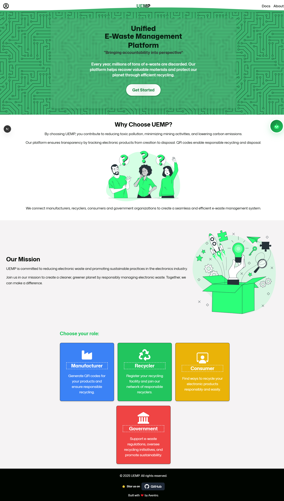
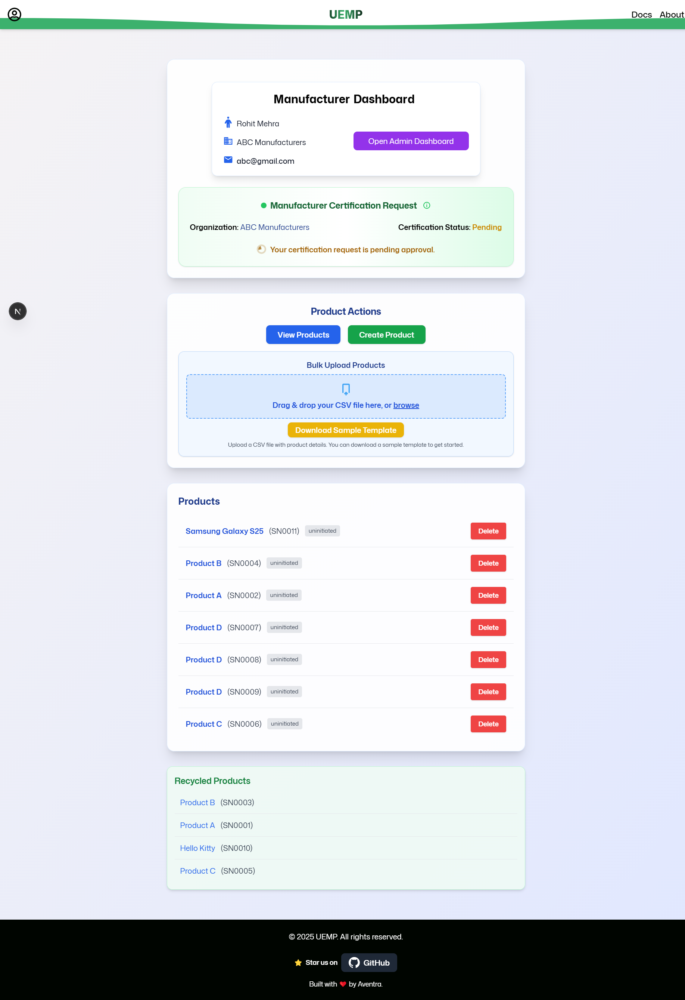
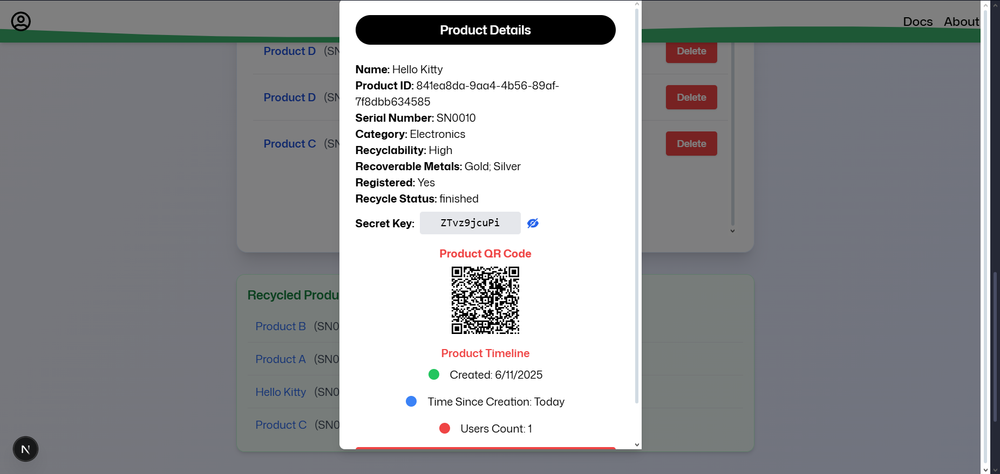
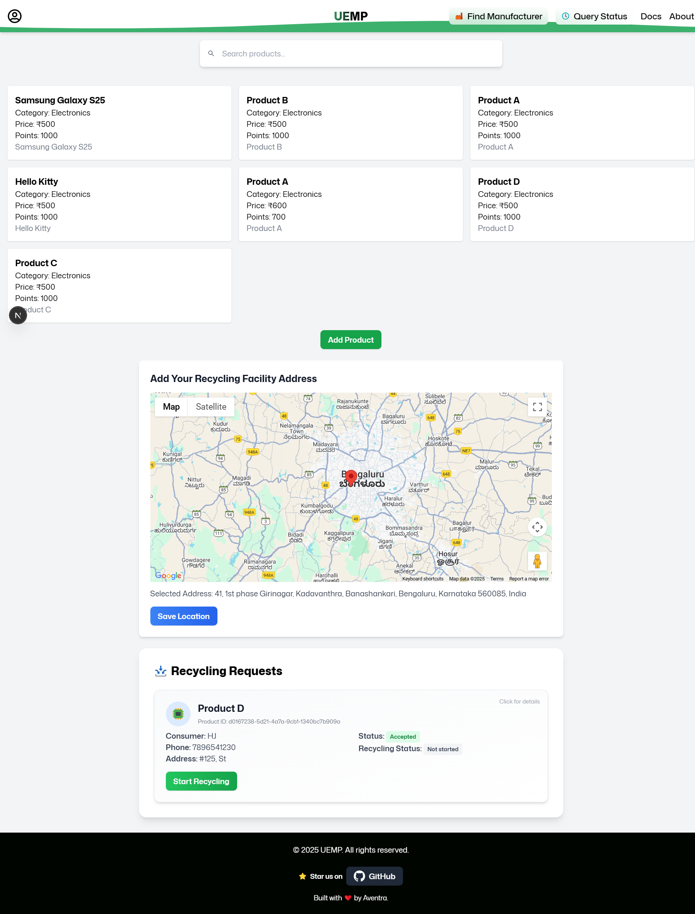
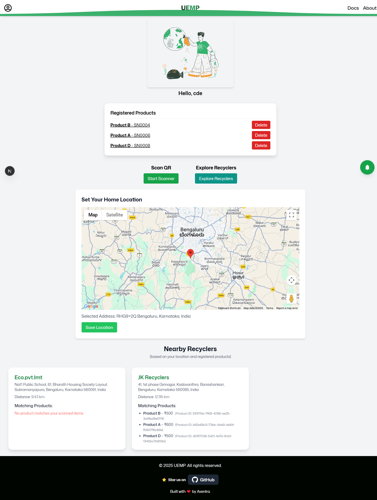

<div align="center">


# **Unified E-Waste Management Platform (UEMP)**


</div>

<div align="center">

[Read the Full Documentation here 👀](https://unified-e-waste-management-platform.vercel.app/docs)

</div>

---

The Unified E-Waste Management Platform (UEMP) is available as both a modern web application and a downloadable desktop app.

**Web App:** Access the platform from any device with a browser at-
<div align="center">

[Visit the Web App 🚀](https://unified-e-waste-management-platform.vercel.app)

### OR

</div>

**Desktop App:** Download and install the Electron-powered app on Windows for a easier user experience.

<div align="center">
<a href="https://github.com/hariharjeevan/Unified-EWaste-Management-Platform/releases/download/v0.1.0/UEMP.Setup.0.1.0.exe">
  
</a>

</div>

## **Overview**

The **Unified E-Waste Management Platform (UEMP)** aims to streamline e-waste tracking and recycling through a unified digital solution. It connects **manufacturers, recyclers, and consumers** to promote responsible e-waste management and lifecycle tracking of electronic products.

---

## **Key Features**

### **1. Manufacturer Features**

#### 📌 **QR Code Generation**

- Manufacturers can generate unique QR codes for their products.
- Each QR code contains product-specific information, including:
  - Manufacturer’s unique reference ID.
  - Product type and class.
  - Material composition.
  - Recyclability score (based on embedded materials).
  - Date of manufacture and estimated lifespan.
  #### 🛠 **Admin Dashboard for Manufacturers**
  - Provides manufacturers with a centralized dashboard to manage their products and QR codes.
  - Features include:
    - Role Based Access Control (RABC)
    - Viewing and editing product listings.
    - Monitoring QR code usage and scan analytics.
    - Managing manufacturer profile.
    - Accessing lifecycle reports for all registered products.
  - Enables efficient oversight of manufacturing operations.
  - Offers export options for product and lifecycle data.

#### 🔄 **Lifecycle Tracking**

- The QR code tracks the product’s journey from **manufacturing to recycling**.
- Data includes **resale, ownership transfers, and recycling status**.

#### ♻ **Registration as Recycler**

- Manufacturers with recycling capabilities can **register as recyclers** through the platform.
- Details such as **recycling specialization and capacity** are included.

---

### **2. Recycler Features**

#### 🏭 **Facility Registration**

- Recyclers can register their facilities and specify:
  - Types of e-waste they handle (e.g., plastics, metals, circuit boards).
  - Recycling processes used.
  - Certifications and compliance details.

#### 🔗 **Service Integration**

- Recyclers can connect with consumers via the platform.
- Option to accept **direct drop-offs or scheduled pickups**.

---

### **3. Consumer Features**

#### 📦 **Product Recycling**

- Consumers can scan the QR code on their product to:
  - View recycling instructions.
  - Locate nearby registered recyclers specializing in their product’s materials.
  - Schedule recycling pickups or drop-offs.

## **Technical Details**

### **1. QR Code Implementation**

#### 🔍 **Structure**

- The QR code embeds:
  - **Unique product ID (UUID)**.
  - **Manufacturer reference**.
  - **Material and recyclability metadata**.
  - **Register device ownership to customers**

### **2. Backend System**

#### 🗄 **Database**

- Centralized database to store **product, manufacturer, recycler, and lifecycle data**.
- Data categorized by **product type, materials, and ownership**.

## **User Interface (UI)**

### **1. Intuitive Design**

#### 🏠 **Homepage**

- Clear navigation with separate sections for **manufacturers, recyclers, consumers and government organizations**.

#### 📊 **QR Code Dashboard (Manufacturers)**

- Simple tools to **generate and track QR codes**.
- Analytics to monitor **product lifecycle data**.

#### 🏭 **Recycler Dashboard**

- **Registration and profile management**.
- **Calendar for scheduling pickups or appointments**.

#### 📱 **Consumer Portal**

- **Product QR code scanner tool**.
- **Nearby recycler locator with map integration**.

## 📸 Website Snapshots

### 1️⃣ Home Screen



### 2️⃣ Manufacturer Dashboard



### 3️⃣ Manufacturer QR Code Generation



### 4️⃣ Manufacturer Admin Dashboard


### 5️⃣ Recycler Dashboard



### 6️⃣ Consumer Portal



### 7️⃣ Government Dashboard


## 🚀 **Get Started**

### **Installation**

```sh
# Clone the repository
git clone https://github.com/hariharjeevan/Unified-EWaste-Management-Platform.git

# Navigate to the project directory
cd UEMP

# Install dependencies
npm install  # or yarn install
```

### **Running the Project**

```sh
# Start the development server
npm run dev  # or yarn dev
```
### **Building from source**

```sh
# Start build
npm run build
```
### **Building the Electron App**

```sh
# Navigate to the 'electron' directory
cd electron

# Install Electron dependencies
npm install

# Package the app for distribution
npm run dist
```
<div align="center">

*__Made with 💖 by Aventra__*

</div>
